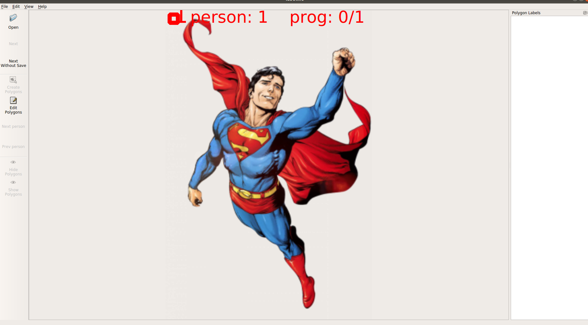

labelme: Image Annotation Tool with Python
==========================================

[](https://pypi.python.org/pypi/labelme)
[](https://travis-ci.org/wkentaro/labelme)
[](https://hub.docker.com/r/wkentaro/labelme)

Requirements
------------

- Ubuntu / macOS / Windows
- Python2 / Python3
- [PyQt4 / PyQt5](http://www.riverbankcomputing.co.uk/software/pyqt/intro)


Installation
------------

**Anaconda**

You need install [Anaconda](https://www.continuum.io/downloads), then run below:

For linux and Mac

```bash
# python2
cd $root_dir_of_labelme
conda create --name=labelme python=2.7
source activate labelme
conda install pyqt
pip install labelme
```

For windows
```bash
# python2
cd $root_dir_of_labelme
conda create --name=labelme python=2.7
activate labelme
conda install pyqt
pip install labelme
```

Usage
-----

**准备**

Please set your input & output directory here: 

- `labelme/app.py` line 78 for input directory
- `labelme/app.py` line 79 for output directory

**Re-Install labelme**
```bash
# Install
$ pip uninstall labelme
$ python setup.py install
```

```bash
# Run
$ python labelme/app.py  # Open GUI
```

The GUI is as bellow:


These're some main buttons:

> `Next`: Save the current image (json) & process the next one

> 'Next Without Saving': Ignore the current image & process the next one

> 'Left Mouse Click': click & choose the corresponding key-point.

> 'Double click in the Widget': Remove key-point

TODO
-----
1. Adding attributes `is_visible` for point being occluded, need to interpolate ...  

